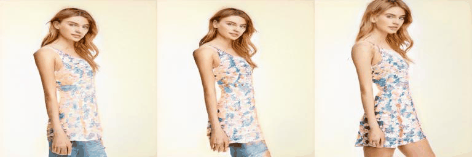
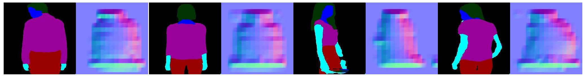

## 3D-Aware Semantic-Guided Generative Model for Human Synthesis (3D-SGAN) <br><sub>Official PyTorch implementation of our ECCV 2022 paper</sub>

Camera Pose           |  Semantic
:-------------------------:|:-------------------------:
  |  

Texture           |  Translation
:-------------------------:|:-------------------------:
  |  

**3D-Aware Semantic-Guided Generative Model for Human Synthesis**<br>
Jichao Zhang, [Enver Sangineto](https://scholar.google.com/citations?user=eJZlvlAAAAAJ&hl=en), 
[Hao Tang](https://scholar.google.com/citations?user=9zJkeEMAAAAJ&hl=en), [Aliaksandr Siarohin](https://scholar.google.com/citations?user=uMl5-k4AAAAJ&hl=en), [Zhun Zhong](https://zhunzhong.site/), 
[Nicu Sebe](http://disi.unitn.it/~sebe/), [Wei Wang](https://weiwangtrento.github.io/) <br>
University of Trento, Snap Research, ETH Zurich, University of Modena e Reggio Emilia

Abstract: Generative Neural Radiance Field (GNeRF) models, which extract implicit 3D representations from 2D images, 
have recently been shown to produce realistic images representing rigid/semi-rigid objects, 
such as human faces or cars. However, they usually struggle to generate high-quality images representing 
non-rigid objects, such as the human body, which is of a great interest for many computer graphics applications. 
This paper proposes a 3D-aware Semantic-Guided Generative Model (3D-SGAN) for human image synthesis, 
which combines a GNeRF with a texture generator. The former learns an implicit 
3D representation of the human body and outputs a set of 2D semantic segmentation masks. The latter transforms 
these semantic masks into a real image, adding a realistic texture to the human appearance. 
Without requiring additional 3D information, our model can learn 3D human representations 
with a photo-realistic, controllable generation. Our experiments on the DeepFashion dataset show that 
3D-SGAN significantly outperforms the most recent baselines.

> Paper: https://arxiv.org/abs/2112.01422 <br>

## Install
```
conda env create -f environment.yml
conda activate sgan
```

## Dataset

To-do lists

## Training 

1)  we will provide the pretrained model of VAE-StyleGANv2, please put the pretrained model into the ./pretrained_models/.
And change dataset path to yours by modifying config files.

2) 3D-SGAN Training

2.1) DeepFashion:
```
bash scripts/train_fashion.sh
```
2.2) VITON:
```
bash scripts/train_VITON.sh
```

## Test and rendering

We will release the pretrained model of the entire pipeline.

1) DeepFashion:
```
bash scripts/test_fashion.sh
```

2) VITON:
```
bash scripts/test_VITON.sh
```

## Inversion for real data editing
```
bash scripts/inverse_semantic.sh

bash scripts/inverse_human.sh
```

## Geometry Visualization using the Normal



## The Evaluation of Multiple-View Consistency: aMP (average Matching Points)

To-do list

## Reference code

[1] https://github.com/autonomousvision/giraffe

[2] https://github.com/rosinality/stylegan2-pytorch

## 

### Citation

```
@article{zhang20213d,
  title={3D-Aware Semantic-Guided Generative Model for Human Synthesis},
  author={Zhang, Jichao and Sangineto, Enver and Tang, Hao and Siarohin, Aliaksandr and Zhong, Zhun and Sebe, Nicu and Wang, Wei},
  journal={ECCV},
  year={2022}
}
```
